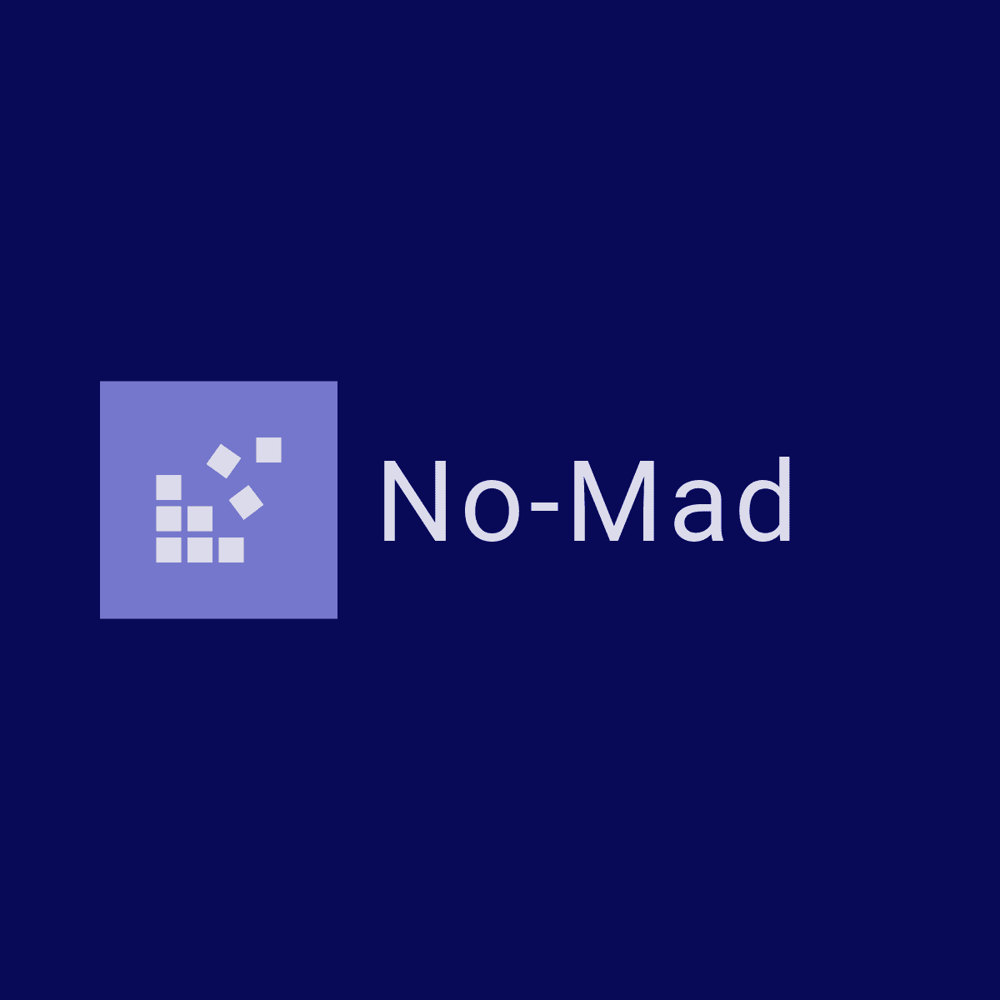
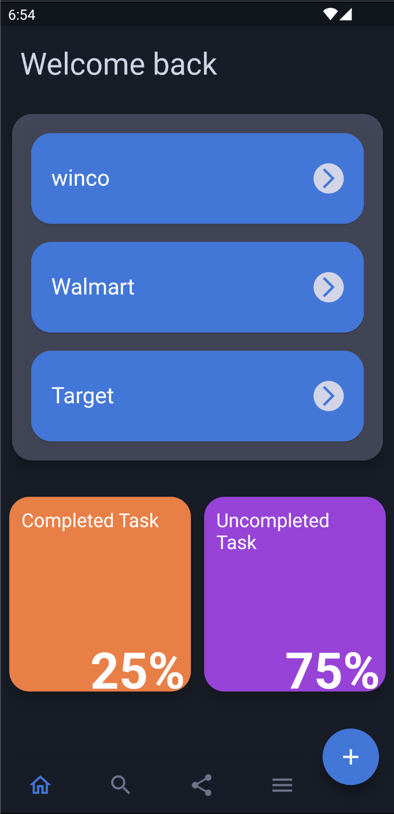
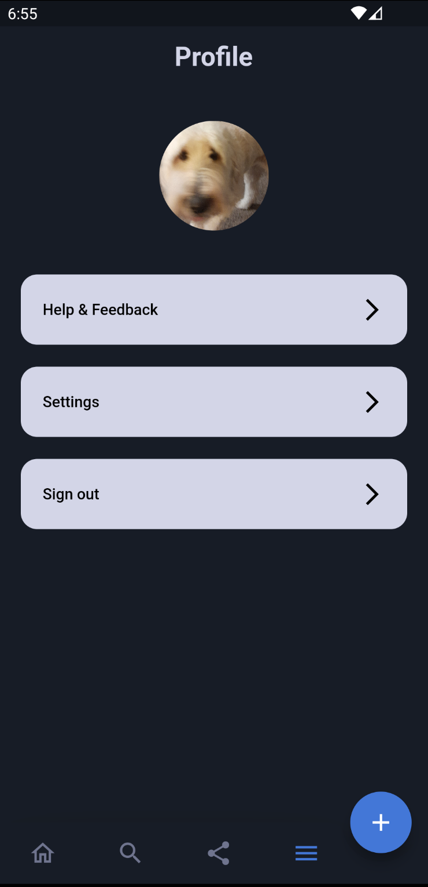

## Project Overview

No-Mad is a Task taking application. That strives to make lists simple and able to colloaborate on lists you decided to share with friends, roommates, significant others ...
In the application you could sign up/ login with google, have a profile picture, share lists with other users ... enjoy using nomad

## Steps to run

    - flutter emulator --launch ** device **  
    - flutter pub get
    - flutter run

## Notes/Refrences

### This section is for the links I used to create this project

- https://stackoverflow.com/questions/70997381flutter-error-no-named-parameter-with-the-name-displaylarge
- https://pub.dev/packages/animated_bottom_navigation_bar/example
- https://pub.dev/packages/google_sign_in/example
- https://pub.dev/packages/firebase_auth/example
- https://pub.dev/packages/cloud_firestore/example
- https://pub.dev/packages/firebase_storage/example
- https://pub.dev/packages/image_cropper/versions/1.5.0/example
- https://pub.dev/packages/image_picker/example

### Videos

- https://www.youtube.com/watch?v=Mt41FpSS-Vo
- https://www.youtube.com/watch?v=dBbYVNoFxkM
- https://www.youtube.com/watch?v=E5WgU6ERZzA

- **Dixons Videos**
- https://www.youtube.com/@JohannesMilke 

## Homepage

## Profile Page

